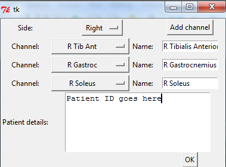
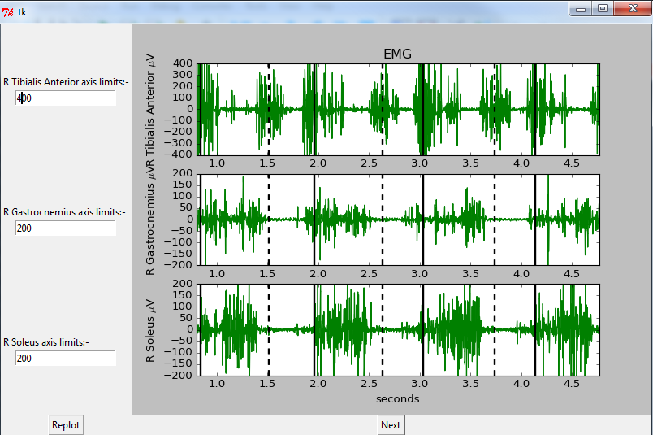

# EMG2PDF
This is a simple Python script to plot EMG data from motion analysis to a PDF. It may not be pretty, but it works! It's just one file so you can get started using it straight away!

## Using EMG2PDF
This software has been validated for research use only. If you want to use it for medical purposes, you are responsible for verifying that it works as intended. If you do find a bug or make an improvement, please consider [contributing](https://github.com/cmasuki/EMG2PDF/compare).

At the moment, EMG2PDF requires Vicon Nexus software to access C3D files (tested on Nexus v2.3 with 64-bit windows). It uses the following Python modules: sys, ViconNexus, Tkinter, tkFileDialog, os, numpy, functools, matplotlib, reportlab, pillow.

Before you start, open Vicon Nexus and use time-bar trial clipping to reduce the length of EMG trials to the region of interest (e.g. 2-3 strides). 

1. Ensure that Vicon Nexus is open and Eclipse is open on the database that contains your database of interest.

2. Double-click on AA-Click-to-run-EMG2PDF or run `python -m EMGtoPDF.py`.

3. Choose the trial that you wish to plot. To plot multiple trials, use shift or ctrl to select.

4. On the next screen, pick the side that you want to plot. Add as many channels as necessary, and for each one pick which channel to plot and change the name if desired. Copy patient details from the Nexus report to the Patient Details textbox. Click Next.

5. On the next screen, check that the plots look suitable. To change Y-axis scaling, enter a different number in the appropriate Axis Limits textbox, and click Replot. Click Finish.

6. Choose the location at which to save your EMG report.

## Benefits of EMG2PDF
* Small and functional graphical user interface so that anyone can use it
* Allows an arbitrary number of channels to be plotted at once (only for one side at a time, I'm afraid!)
* Allows channels to be renamed
* Allows easy scaling of axes
* Quick to use and can report multiple trials at once!

## Future work
The following are potential future developments:-
* Remove the reliance on the proprietary ViconNexus for opening C3D files.
* Indication of normal muscle on/off during gait cycle
* (Optional) Automatic axis scaling

Any help would be very welcome.

_The initial user interface allows channels to be chosen and renamed (as below)._

_Each trial has its own screen to check and resize plots._

